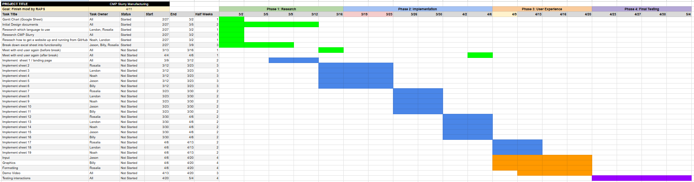

# March 3rd, 2025

# Initial Gantt Chart

# Answers to other questions
1) **Take a picture/screenshot of your white board, post it notes, Google doc, or whatever you use for initial brainstorming.**
    
    

2) **Tell me what GANTT chart tracking software you've chose to use (Excel, Google sheets, dotProject, etc.)**
    
    Gantt chart tracking software:
    Google Sheet

3) **Submit a PDF version of your initial schedule with half week intervals. It should show the critical path, dependencies among subtasks,  who will do what, etc.**
    
    Link to PDF:

4) **Propose a plan for updating the GANTT chart each week. Will you meet to update it collectively? Will you identify one person who will be in charge of actually updating the GANTT chart and exporting a PDF version along with some high level notes about how it has changed (more subtasks added, some subtasks completed, critical path slipping, new estimates)?**
    
    Propose Plan for Updating Gantt:
    Each week, every Thursday during class time

5) **Describe your anticipated/target MVP as well as at least one "Plan B" MVP for if the schedule is slipping and a "Plan A+" if things are going really well.**
    
    Plan A
    * An open source website that anyone could have access to, this would be the most useful for accessibility for research.

    Plan B
    * An app you could download from GitHub or partial functionality of the website. This would allow for partial use as well as accessibility.

    Plan C
    * An accessible script

6) **What is on the critical path in your GANTT chart towards your MVP?**

    The critical path in our GANTT chart is the things higlighted in green. By understanding the Excel and researching, it gives our group the necessary information needed to build the website.

7) **Identify a list of key risks to the success of your project. Make a plan for resolving the risks as early as is possible.**
    
    Key Risks to the success of this project:
    * Meeting up (team meeting)
    * Staying on track
    * Skill limits

