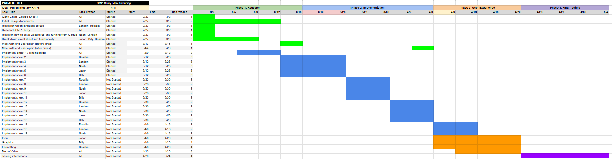
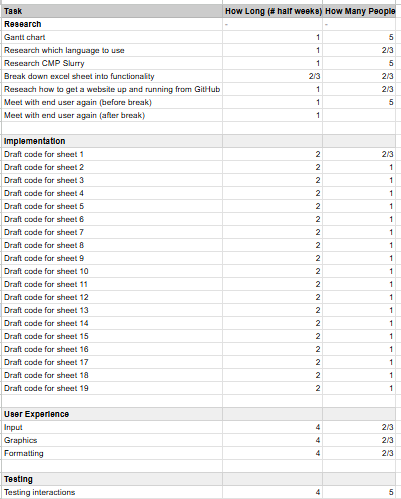
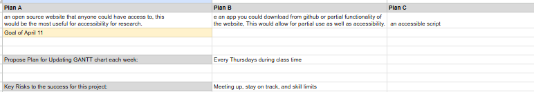

# March 24th, 2025

After meeting with the user and discussing among team members, we made some changes to the Gantt Chart.
Majority of the thing stayed the same, execept for the amount of tasks, showed in the Gantt chart.

## Update V1 of Gantt Chart

Comparing this to the inital Gantt Chart, most of the things were combined into one. Hence, we split our group into 2 sections, where some work on the frontend and some work on the backend of the project. By doing so, we distribute the workload.

## Update V1 of Tasks

## Update V1 of Goal

