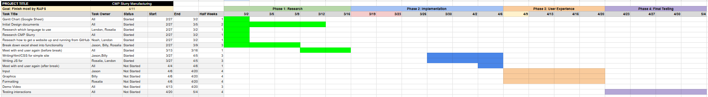

# March 31st, 2025

After another group meeting on March 27th, we decided to update our Gantt chart. We noticed that the previous Gantt Chart had many tasks that overlapped.

## Update V2 of Gantt Chart

From this Gantt chart, we can see that all the "implementation sheet ##" is gone. This is because we realized that we don't have to implement every single tab from the Excel sheet. Some of the tabs are just extensions to another. For instance, the "input" tab is the layout for the "process" tab. Hence, we only need to implement the "input" tab from the Excel and use JavaScript to process that information.

This allowed us to simplify our Gantt chart and make the tasks more understandable to execute later on.
