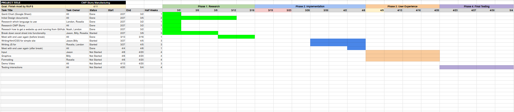

# April 6th, 2025

Currently the majority of the static part of the website has been completed. Most of the frontend things are completed, but it needs to be polished to look better. As of know we are working on the dynamic part of the website. This includes, making a working calculator do compute data, and revising the Excel to only contain data. That way we can tranfer the data from the Excel and implement it into our website.

**More information on what were working towards from the link below**
[Link to Week Overview](Weekly_overview.docx)

## Update on Gantt Chart

The Gantt Chart is the same as before, only that now we are more focus on the dynamic part of the website instead of the static. After we implement the dynamic part, we will need to polish the website up that way it functions as intended.
